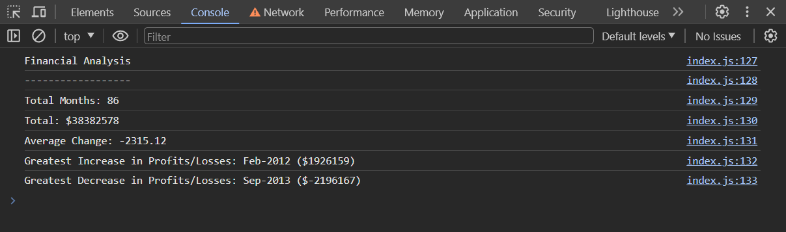

# Console-Finances

## Description 

This little project was a intruduction to JavaScript. Based on our knowledge we aquired durring first few days, and a bit of reasarch we should be able to create a script which alowes us to extract specific infomation from a 'big' array. Let's see how it went. 

#### Acceptance Criteria

You have been given a dataset composed of arrays with two fields: Date and Profit/Losses.

Your task is to write JavaScript code that analyzes the records to calculate each of the following:

* The total number of months included in the dataset.

* The net total amount of Profit/Losses over the entire period.

* The average of the changes in Profit/Losses over the entire period.

* The greatest increase in profits (date and difference in the amounts) over the entire period.

* The greatest decrease in losses (date and difference in the amounts) over the entire period.

[Link to website](https://narkhashel.github.io/Console-Finances/)

## Credits

I would like to say that I came up with everything on my own, but I bounced off some ideas together with my colleagues from a boot camp. I also had a bit of insight from my trainer to help me understand different approaches to this task.

## License

N/A
 